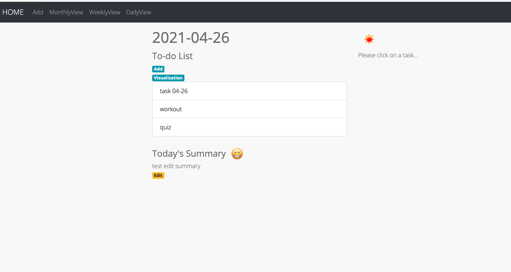
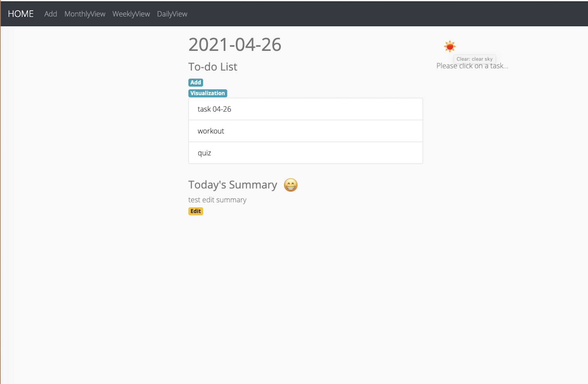
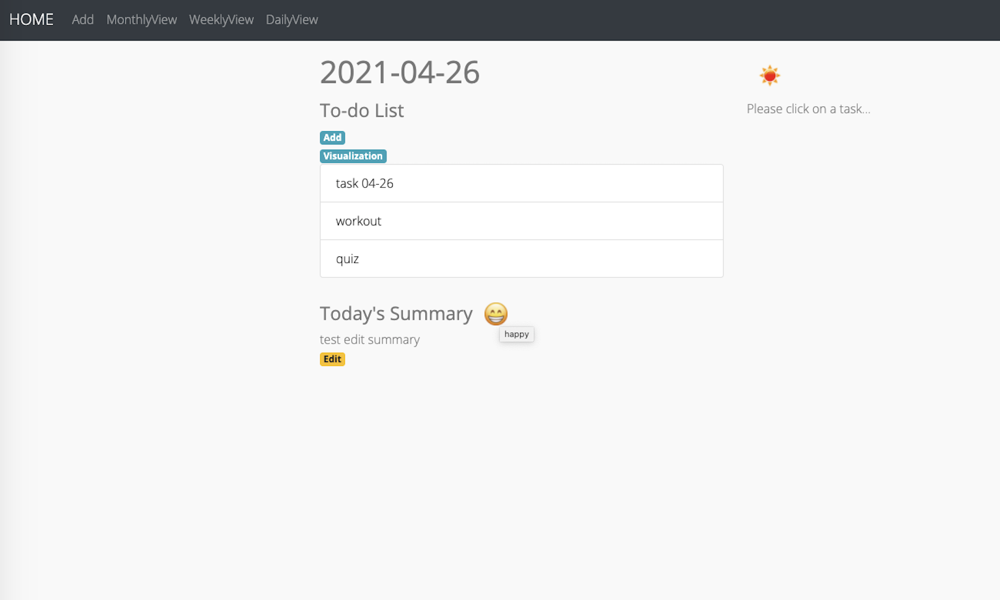
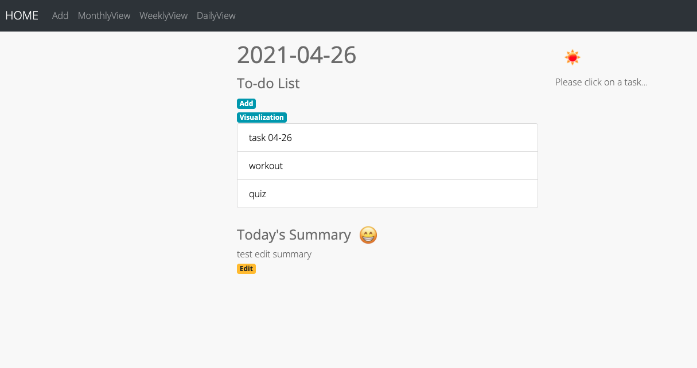
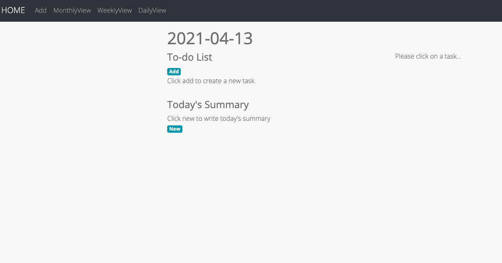
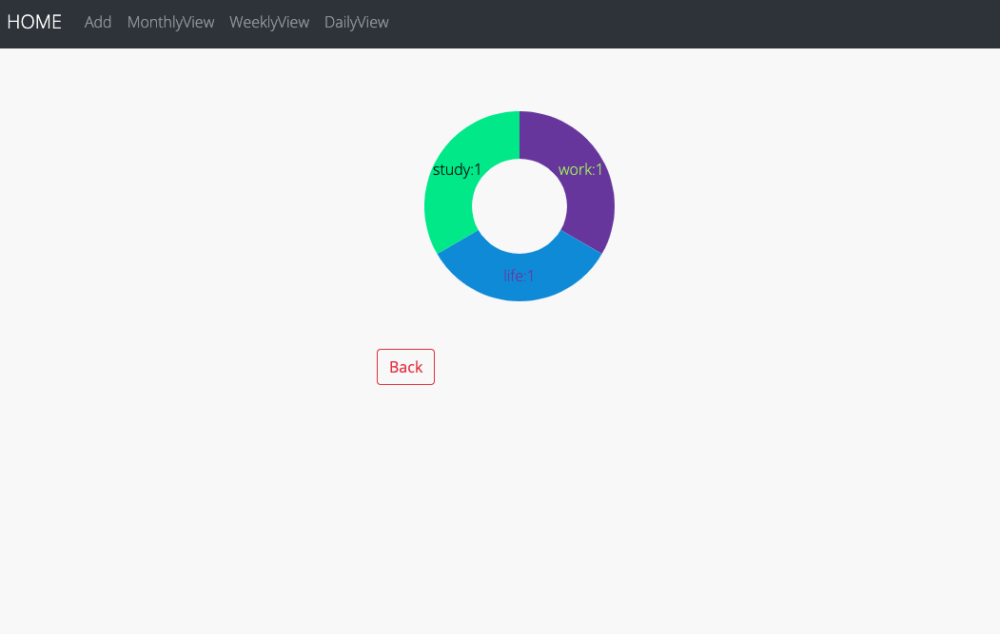

Manual Test Plan
============
Prerequisite and environment setup
---------------
Python 3.8.5\
React\
React-router-dom\
React-router

Run backend
----------
```bash
cd backend_together/
python3 server.py
```

Run frontend
----------
```bash
cd web-calendar/
npm start
```

Test 1: Today's weather
------------
Navigate to homepage, which will show today's daily overview.\
Desired output: on the right of the date, there will be an icon indicating today's weather.



Test 2: Weather hover effect
-------------
Put the mouse on the weather icon.\
Desired output: description of weather will show up.



Test 3: Emotion hover effect
--------------
Put the mouse on the emotion icon in the daily overview page.\
Desired output: Description of emotion will show up.



Test 4: Link for visualization
-----------------
Navigate to a daily overview page.\
Desired output: if tasks exist, there will be link to visualization. If there're not tasks, the link will be hidden.

Tasks exist:



No tasks:



Test 5: Visualization--pie chart for tasks
-----------------
Navigate to a daily overview page that has tasks, click on the link for visualization.

Desired output: a pie chart of this day's tasks for each type and count will show up.

