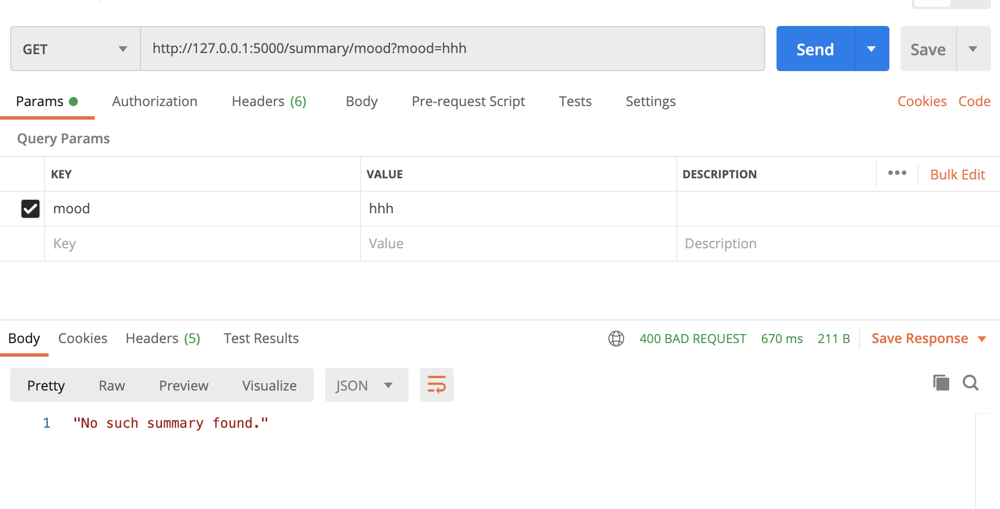
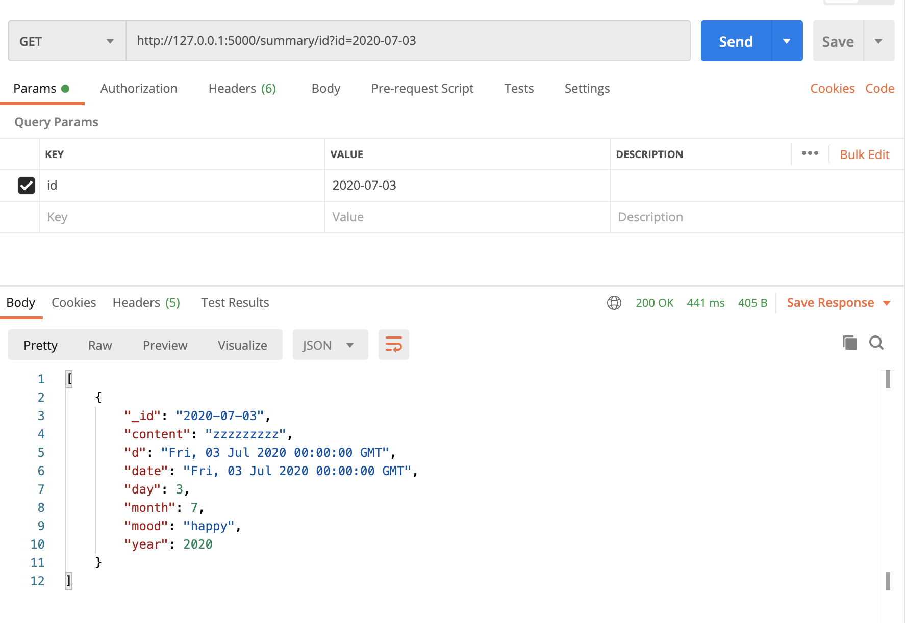
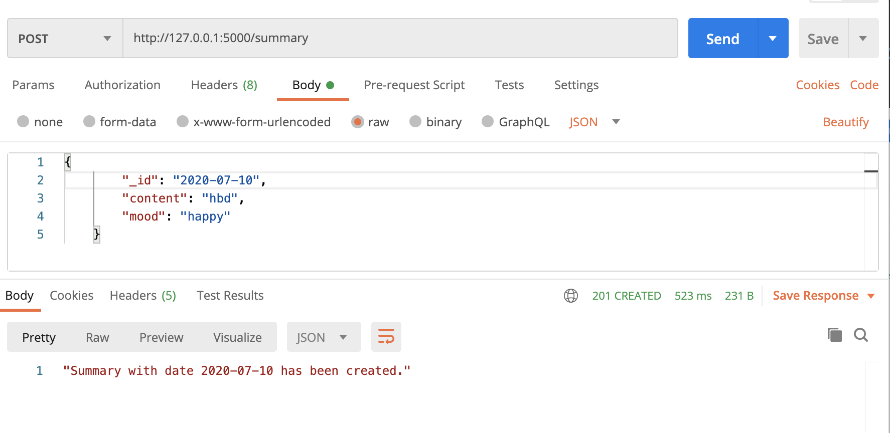
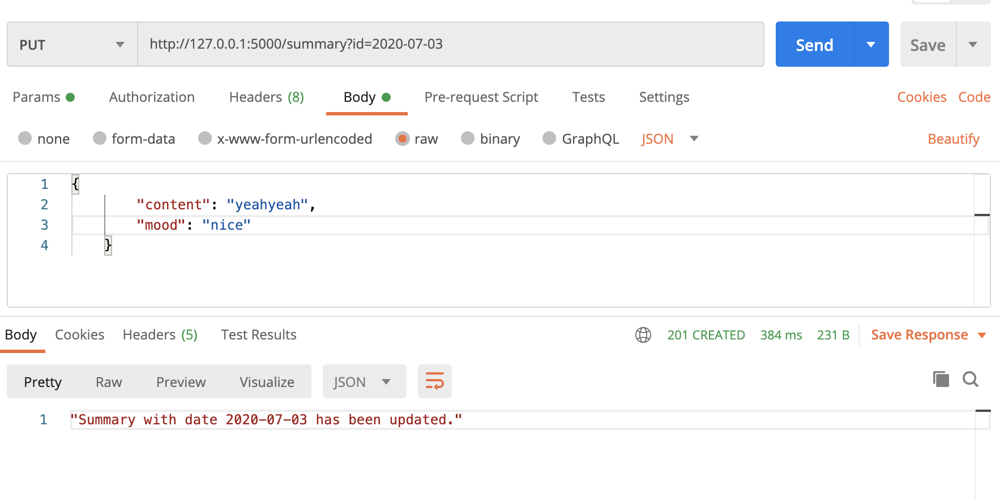
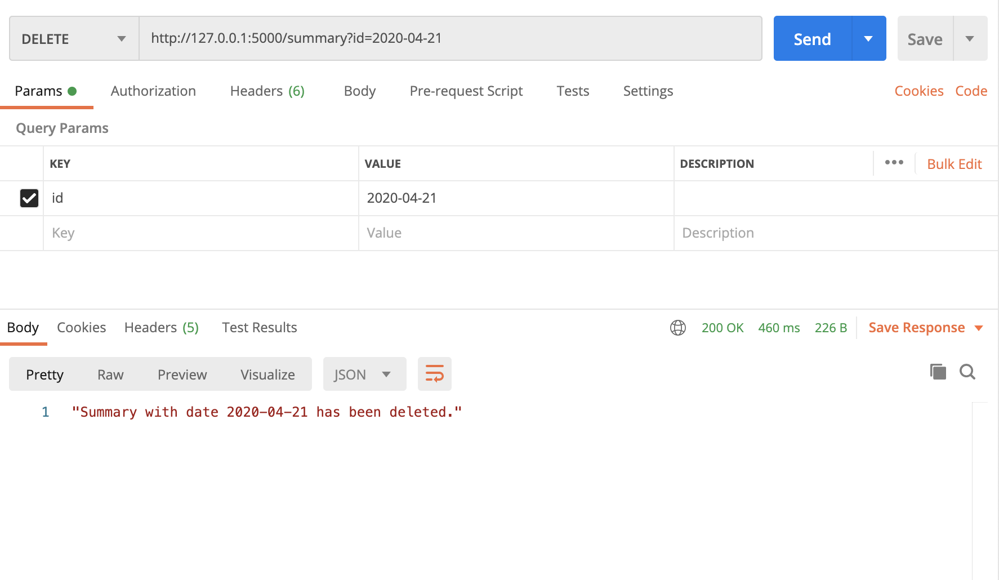

Manual Test Plan
============
Prerequisite and environment setup
---------------
Python 3.8.5\
Postman

Start server
----------
```bash
Python3 ~/daily_summary_server.py
```

Test 1: GET not found message
-----
Use get API to search for an non-exist document\
Example: GET http://127.0.0.1:5000/summary/mood?mood=hhh \
Desired output:



Test 2: GET found message
------------
Use get API to search for existing documents\
Example: GET http://127.0.0.1:5000/summary/id?id=2020-07-03 \
Desired output:



Test 3: POST valid document
----------------
Use post API to upload a valid documents\
Example: POST http://127.0.0.1:5000/summary \
with body: {
        "_id": "2020-07-10",
        "content": "hbd",
        "mood": "happy"
    }\
Desired output:



Test 4: PUT existing document by id
-------------
Use put API to update an existing document by id\
Example: PUT http://127.0.0.1:5000/summary?id=2020-07-03 \
with body: {
        "content": "yeahyeah",
        "mood": "nice"
    }\
Desired output:



Test 5: DELETE existing document by id
----------------------
Use delete API to delete an existing document by id\
Example: POST http://127.0.0.1:5000/summary?id=2020-04-21 \
Desired output:

