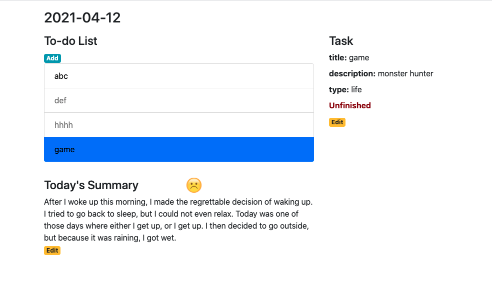
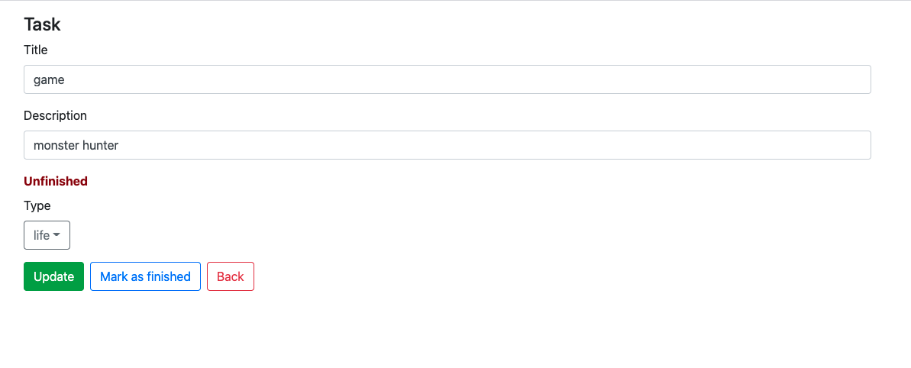
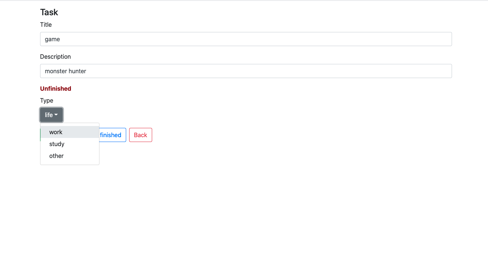
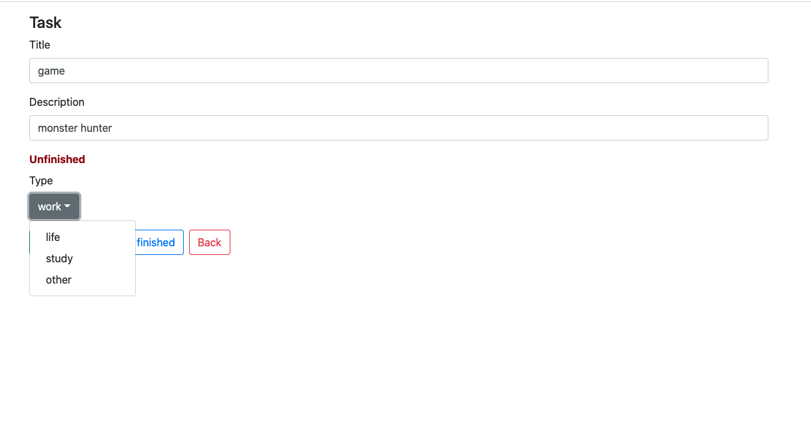
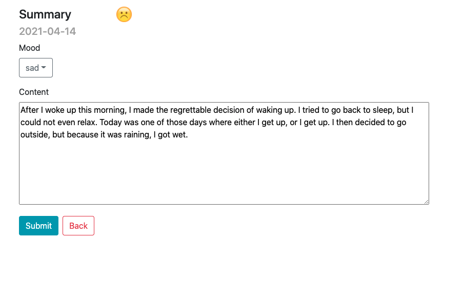
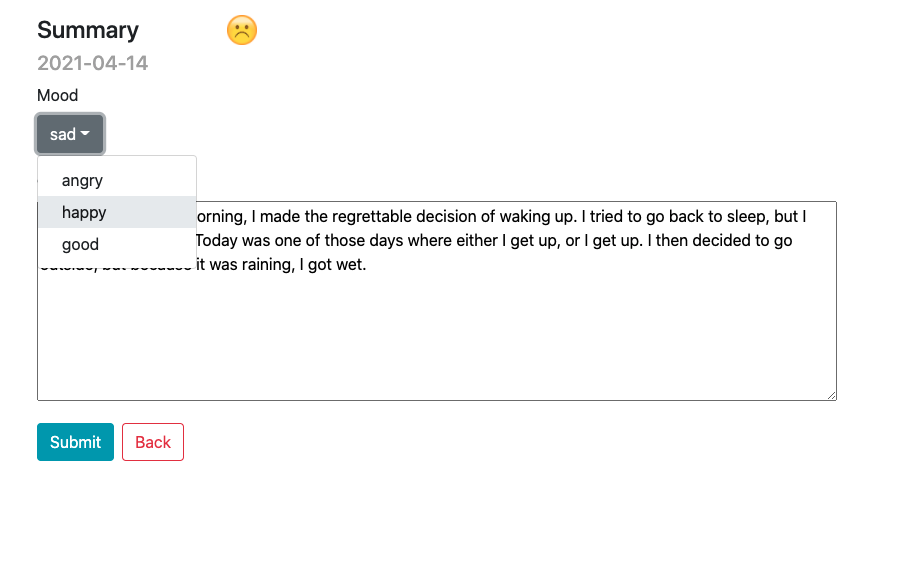
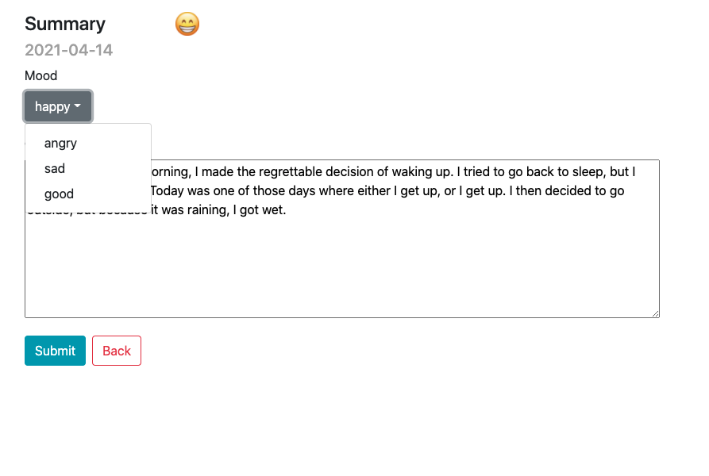

Manual Test Plan
================
Prerequisite and environment setup
-----------------

React\
React-router-dom\
React-router

Run static frontend
----------
```bash
cd frontend/web-calendar/
npm start
```

Test 1: Show task details
----------
On daily view page, click on the title of a task\
Desired output:\
Selected task turns blue, and details of this task show up on the right.



Test 2: Navigation to edit task view
-----------
Click on the edit button on the right\
Desired output:\
Page for edition task shows up.



Test 3: Dropdown for type of task
-----------------
In the edit task page, click on the dropdown for changing type and select another task, 
i.e. if current type is 'life', select 'work'.



Desired output:
The placeholder for dropdown changes to the selected type, and options will also adjust to the rest types.



Test 4: Navigation to edit summary view
-------------

On the daily view page, click on the edit button under the summary.\
Desired output:
The page for edition summary shows up.



Test 5: Dropdown for mood of summary
---------------------
In the edit summary page, click on the dropdown for changing mood and select another mood,
i.e. if current mood is 'sad', select 'happy'.



Desired output:
The placeholder for the dropdown and the emotion on the top changes to the selected mood, 
and options will also adjust to the rest moods.

