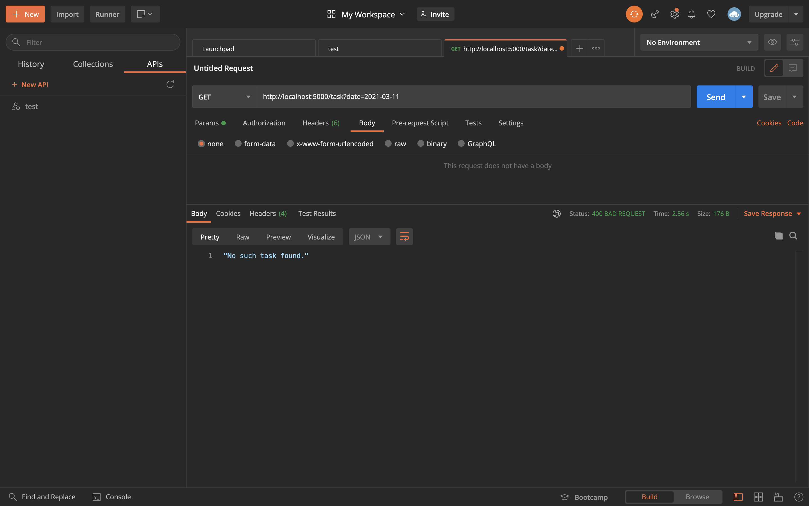
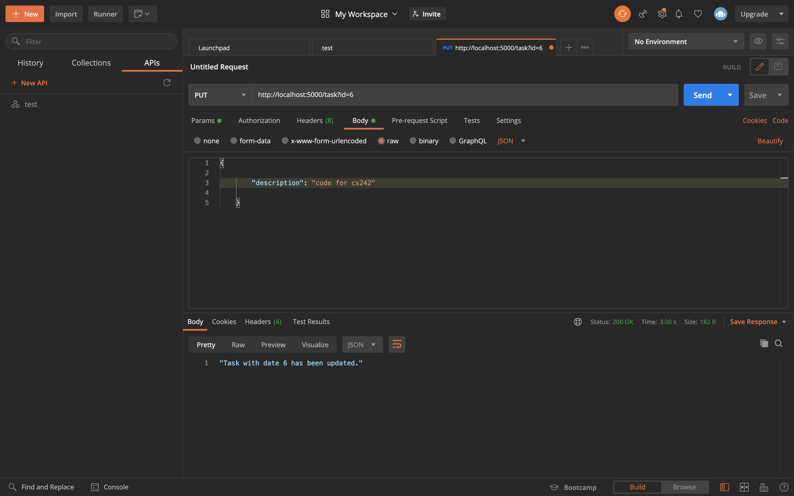
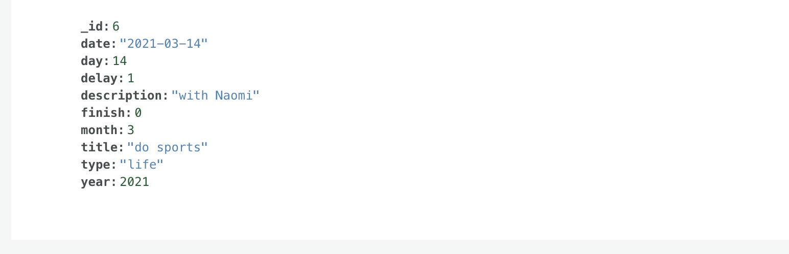
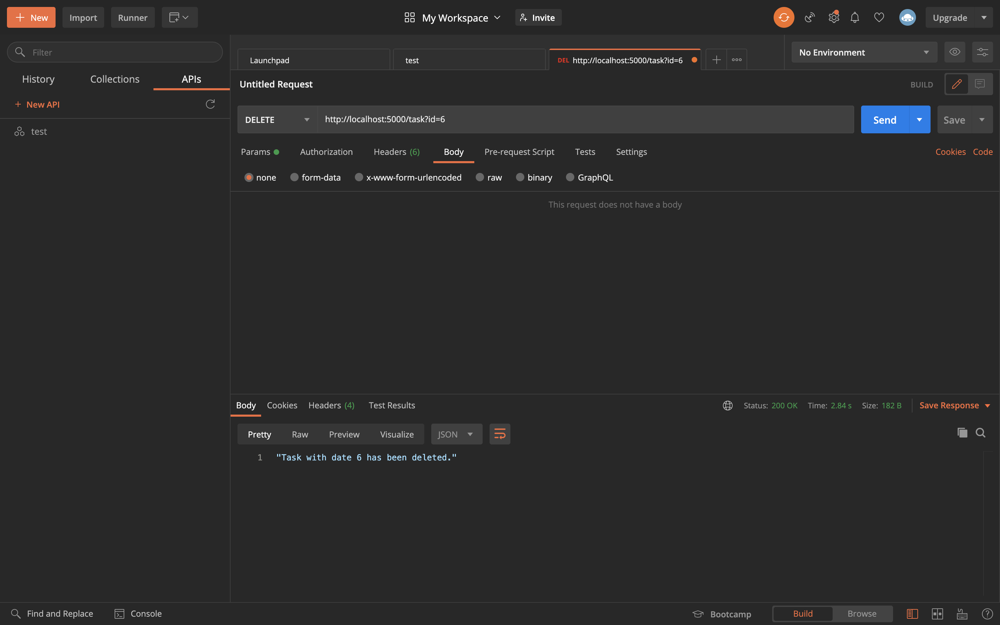
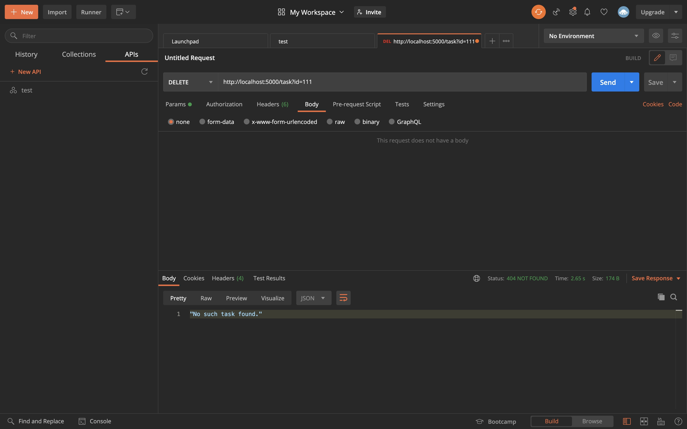
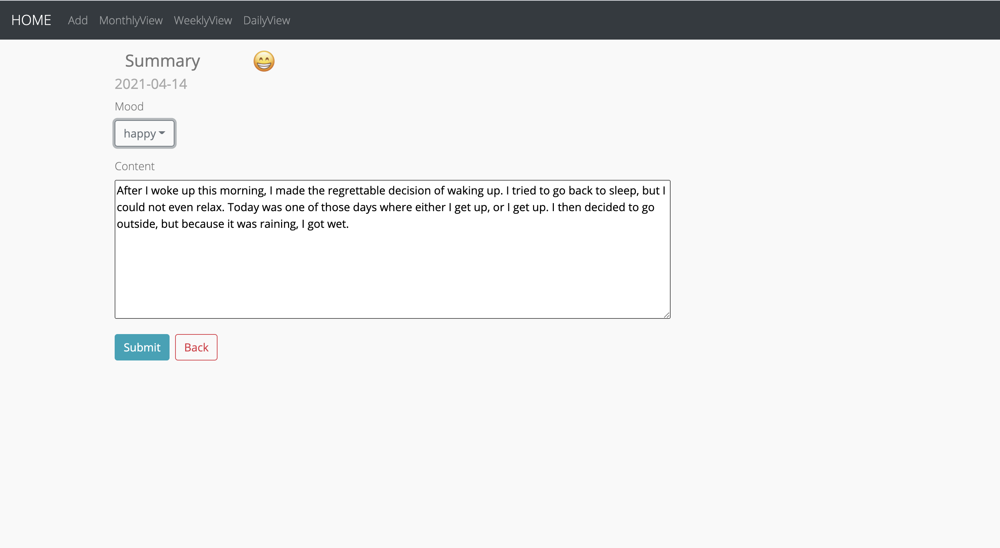

# Manual Test Plan

## Version 1.3

This manual test plan extends the web server for daily task for Qirui Lu and Xiaoying Zhu's final project, with the help of Postman to simulate user requests. It also extends the frontend which combines both of Xiaoying and Qirui's parts.

## Prerequisite

1. macOS 10.15.7 (19H2) is the recommending operating system
2. Python 3.8 with `pymongo`, `request`, `re`, `flask`, `pyaztro` should be installed for the server.
3. Postman 7.36.5 is required.
4. React App is required.

## Environment Setup and configurations

Please download the source file and run task_server.py with command `python3 server.py` to start the server. Then use Postman with `http://localhost:5000/` to manually test different APIs. For frontend, please run `npm start` to visist the website.

## Tests for the task server

This is a screenshot of a glimps of the database.

We will display the moderations of our databse after calling different APIs.

For the `GET` request, The API will get all the matched data with the desired date. Moreover, if the user wants to delay the unfinished tasks and put them off to the next day, the API will only get data with delay equals to 1.

If the request in Postman is: `http://localhost:5000/task?date=2021-03-15`, then we want to get all the tasks on 2021.03.05. The Postman will return:

The database contains two tasks. We notice that the delay value for the first task is 1, and the second one is 0. Therefore, if we want to specify delay equals to 1 and make another request: `http://localhost:5000/task?date=2021-03-15&delay=1`, the Postman will return:

It will only get the tasks from the desired date which has delay value 1.

If there is no data in the databse, the Postman will return `No such task found.`, with status code 404:

If the request is invalid, say the attribute does not exist: `http://localhost:5000/task?name=2021-03-11`. The Postman will return `Please specify task.` with status code 400.

For the `POST` request, the API will add a new document into the database.

All the required information will be passed in the body, once the post request is success, the Postman will return a message with the new task id `Task with id 6 has been created`. If we look back to the database, we will find the new data:

If we want to insert the same data again, it will occur an error due to the id duplication. The Postman will return `"Task with id 6 cannot be created."`:

The message will show up if the new task has not been created.

For the `PUT` request, the API can update any valid attribute. Say we want to update the description for task id 6. We send the reuqest `http://localhost:5000/task?id=6` with the new description.

If success, it will show the message with the id `"Task with date 6 has been updated."` The database will be updated to:

The put API also support update multiple attributes at the same time.

In the database:

For the `DELETE` request, the API will delete a task according to the id. If we want to delete task 6, the reqest will be `/task?id=6`, and the Postman will show:

If success, the message will show `Task with date 6 has been deleted.`

If the id does not exist, the message will be `No such task found.` with status code 404.

## Tests for the frontend for week3

By combining the frontend with Xiaoying, the home page looks like this:

The home page is a daily view page for the present day. It shows the date, the tasks and the daily summary.

If we click on the task it will show the details in the right side.

The `edit` button on the right side will redirect to the task editing page:

The type attribute has a dropdown, which looks like this:

Since the backend still needs to be combined, we will leave it to the next week.

Now, Let's back to the Home page.

The color of the text for tasks has two different kinds. If the task has been finished, it will in gray, otherwise it will be black.

By clicking on the `edit` button at the bottom, it will redirect to the summary editing page.

If we change the mood, the image will also change.

Now, Let's take a look at the weekly overview. The default weekly page will display the present week.

It will display the task title for each day. By clicking on the prev/next week button, the tasks and week will also change.

If we click on a specific day, it will redirect to its daily view page as well.

Finally, Let's do some test for the monthly oveerview page.

For each day, it will shows the number of tasks to be done. The mood data will be added once the backend has been combined. Besides, the user can also go to the daily view of a specific day by clicking the day.

## Tests for the frontend for week4

Now, we have completed most of the features of our webpage. Let's start the server and render the home page.

As you can see, the home page will show us the lucky number for today. Since the lucky number is generated from horoscope, so we cannot get the lucky number for the future, and we are not able to record lucky number from the past, because it is useless. Therefore, except for today, the daily page will not give us the lucky number. For example, if we check on tomorrow or yesterday:

We also add the delay function for the daily page.

First, we can delay a task in the editing task page:

Say we want to delay this task to tomorrow. By clicking on the Delay button, the unfinished task (actually can also be finished task) will be delayed to tomorrow.

Now, if we go back to the daily view, u will not be able to see the task:

By checking out the WeeklyView, we can find out that the task has been delayed to the next day:

We go back to the home page. As you can see, we have 2 tasks to be finished and 1 tasks has already finished.

If we click on the Delay All button, all the unfinished tasks will be delayed to the next day.

Therefore, the home page only displays the finished tasks of that day.

By checking to the weekly view page, we will see all the unfinished tasks have been delayed.

Notice that in the WeeklyView, all the finished tasks are in green and all the unfinished tasks are in red.

The MonthlyView has also get improved, it is able to show the DONEs and TO-DOs in green and red respectively.

So, that's it! All the work from my "tasks end" and I am really proud of myself for such a website. Besides, I am especially grateful to my partner Xiaoying Zhu, who really support me on my parts and my life as well, since I have been through a really tough time at the beginning of our project.

If you read the entire manual test plan, I would be so appreciative for all your patience, understands and helps Amirtha. Thanks a lot and a lot. Hope you do well in your life.
