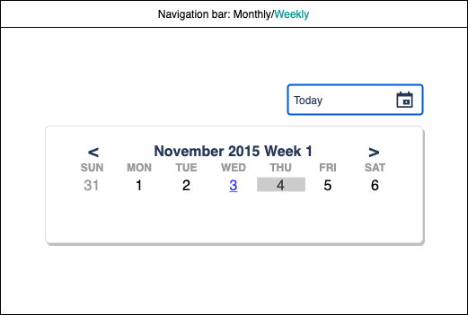
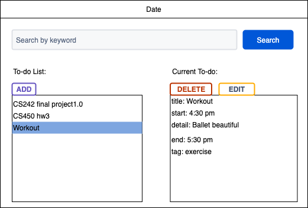
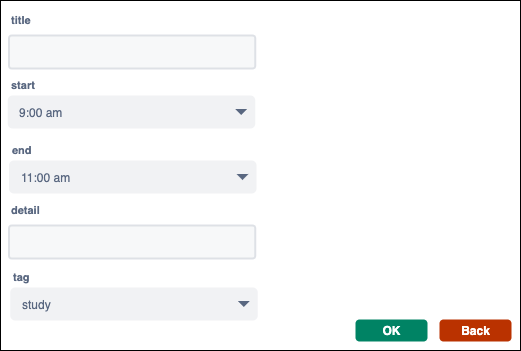
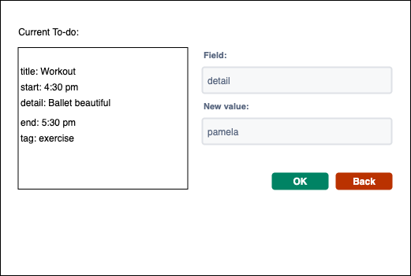

# A Web Diary Calendar

Xiaoying Zhu (xz45) | Moderator: Zehua Chen (zehuac2)

Qirui Lu (qiruilu2) | Moderator: Amirthavarshini Sureshbabu (as43)

This is a web app about a project for CS 242

## Abstract

### Project Purpose

The project provides a user-friendly interface that allows the user to schedule daily tasks. Users can mark up whether they finish the tasks or not. Moreover, They can also write down their feedbacks or summaries at the end of each day. In general, we want to create this project to better plan our life and record life.

### Project Motivation

Current web calendars like Google Calendar usually have professional UI for monthly overview. We would like to build a new one with extension that focuses more on daily planning, which is more like a diary or planner and give users more options in creating their agenda.

## Technical Specification

- Platform: Cross-platform app (React Native or React)
- Programming Languages: JavaScript (Python for Flask should backend required), MongoDB for database
- Stylistic Conventions: Airbnb JavaScript Style Guide, Python Style Guide
- SDK: IDK, Python3.8
- IDE: Visual Studio Code, Pycharm
- Tools/Interfaces: React, D3.js
- Backend: Flask, MongoDB
- Target Audience: Broad-range audience

## Functional Specification

### Features

- Monthly, weekly Overview
- Daily plan editing
- Daily summary
- Data(Task) analysis
- CRUD operations for daily To-do List

### UI Sketch
Monthly Overview

Weekly Overview

Daily Overview

New Task

Edit Task

### Scope of the project

- This project currently might be only deployed on localhost
- POST API may only create 1 task at a time
- Assuming PUT API only allows to update 1 attribute at a time

## Brief Timeline (Z for ZHU, L for LU)

- Week 1:

  1. design MongoDB database schema (Z & L)
  2. set up Flask server with APIs(PUT, GET, POST, DELETE) (Z)
  3. Query parser for querying tasks/daily summary(Z & L)
  4. Server can display desired messages in Postman (Z & L)
  5. Error handling for backend (Z & L)

- Week 2:

  1. Frontend layer design, with static UI for testing purpose (L)
  2. Implement navigations between pages (L)
  4. Manual test for UI design (Z & L)

- Week 3:

  1. Design VMC architecture for the project (Z & L)
  2. Bind the frontend and backend, implement controllers for each UI component (Z & L)

- Week 4:

  1. Additional functionalities (Z & L)
  2. API for Weather forecast(Z)
  3. Polish the UI design to be more user-friendly(Z & L)
  4. Frontend can visualize daily routines in terms of different kinds of tasks. (L)

## Detailed division of labor by week

| Week               | Qirui Lu                            | Xiaoying Zhu                        |
| :----------: | :---------------------------- | :---------------------------- |
| Week 1|- Design schema for to-do and daily summary   - impelement desired API routes for task   - query parser for task   - write exception classes and handle them in server   - test APIs using Postman   - Unit tests | - Design schema for to-do and daily summary   - impelement desired API routes for daily summary   - query parser for daily summary   - write exception classes and handle them in server   - test APIs using Postman   - Unit tests|
| Week 2|- Monthly overview design   - Weekly overview design   - Add new task page design  - Eslint   -Pylint   - Manual test plan for UI design |- Daily page design   - Edit task page design   - Edit daily summary page design  - Eslint   -Pylint   - Manual test plan for UI design |
| Week 3|- Design VMC architecture for the project   - make requests for editing task   - make requests for editing daily summary   - render results   - Manual test plan|- Design VMC architecture for the project   - make requests in daily page   - make requests for adding new task   - render results   - Manual test plan|
| Week 4|- Additional functionality(i.e. delay today's task) backend   - Additional functionality(i.e. delay today's task) frontend   - Additional features for daily page(i.e. daily lucky number generator)   - Polish UI style|- Additional functionality(i.e. data visualization) backend   - Additional functionality(i.e. data visualization) frontend   - Additional features for daily page(i.e. today's weather)|

## Rubrics

### Week 1

 Qirui's rubric ([calculator](https://drive.google.com/file/d/1QCMuq6p2tM5wJUk06-6BidM-EwVZbU1d/view?usp=sharing))

| Category        | Total Score Allocated | Detailed Rubrics                                                                               |
| --------------- | :-------------------: | ---------------------------------------------------------------------------------------------- |
| MongoDB databse |          3            | 0: Didn't implement anything   +1: implement proper attributes   +1: connect the database   +1: use environment variables for security |
| Flask backend for task  |          5            | 0: Didn't implement anything   +1.25: implement each API(PUT GET POST DELETE)               |
| Query parser    |          5            | 0: Didn't implement anything   +1: support logic operator 'NOT'   +1.5: support logic operator 'AND'   +1.5: support logic operator 'OR'   +1: support double quotes(contains vs. exactly match)|
| Error handling  |          2            | 0: No error handling   +1: correct use of status code   +1: properly reporting errors    |
| Manual test plan for Postman|          5            | 0: No manual test plan   +1: per test                                                       |
| Unit Test       |          5            | 0: No unit test   +0.5: per unit test                                                     |

 Xiaoying's rubric ([calculator](https://drive.google.com/file/d/1pwzflO5HPLerT7KHtETGnilA5TWMTS3r/view?usp=sharing))

| Category        | Total Score Allocated | Detailed Rubrics                                                                               |
| --------------- | :-------------------: | ---------------------------------------------------------------------------------------------- |
| MongoDB databse |          3            | 0: Didn't implement anything   +1: implement proper attributes   +1: connect the database   +1: use environment variables for security |
| Flask backend for daily summary  |          5            | 0: Didn't implement anything   +1.25: implement each API(PUT GET POST DELETE)               |
| Query parser    |          5            | 0: Didn't implement anything   +1: support logic operator 'NOT'   +1.5: support logic operator 'AND'   +1.5: support logic operator 'OR'   +1: support double quotes(contains vs. exactly match)|
| Error handling  |          2            | 0: No error handling   +1: correct use of status code   +1: properly reporting errors    |
| Manual test plan for Postman|          5            | 0: No manual test plan   +1: per test                                                       |
| Unit Test       |          5            | 0: No unit test   +0.5: per unit test                                                     |

### Week 2

 Qirui's rubric ([calculator](https://drive.google.com/file/d/1SROfHDijvvUVq2Z0KdZoQ5X4sHGw6g4h/view?usp=sharing))

| Category        | Total Score Allocated | Detailed Rubrics                                                                                               |
| --------------- | :-------------------: | -------------------------------------------------------------------------------------------------------------- |
| Monthly overview design|         5        | 0: Didn't implement anything   +3: be able to render a monthly calendar   +2: be able to navigate to a certain daily page|
| Weekly overview design |          5           | 0: Didn't implement anything   +3: be able to render a monthly calendar   +2: be able to navigate to a certain daily page |
| Add new task page design      |          5           | 0: Didn't implement anything   +2: render textboxes   +2: render dropdown component for certain attributes   +1: navigate back to daily page|
| Eslint |          2           | +1: Eslint is properly set   +1: No warning|
| Pylint |          3           | 0: 7.5 below   +1: 7.5 and above   +2: 8.5 and above|
| Manual test plan for static UI|          5           | 0: No manual test plan   +1: per test |

 Xiaoying's rubric ([calculator](https://drive.google.com/file/d/15sCYny744lYb5ViZGN88eYI84hdG1KhV/view?usp=sharing))

| Category        | Total Score Allocated | Detailed Rubrics                                                                                               |
| --------------- | :-------------------: | -------------------------------------------------------------------------------------------------------------- |
| Daily page design|         5        | 0: Didn't implement anything   +1: be able to render list component for to-do list   +1: be able to render details of selected task   +1: render desired buttons    +2: navigate to different pages|
| Edit task page design |          5           | 0: Didn't implement anything   +2: render textboxes   +2: render dropdown component for certain attributes   +1: navigate back to daily page|
| Edit daily summary page design |          5           | 0: Didn't implement anything   +2: render textboxes   +2: render dropdown component for certain attributes   +1: navigate back to daily page|
| Eslint |          2           | +1: Eslint is properly set   +1: No warning|
| Pylint |          3           | 0: 7.5 below   +1: 7.5 and above   +2: 8.5 and above|
| Manual test plan for static UI|          5           | 0: No manual test plan   +1: per test |

### Week 3

 Qirui's rubric ([calculator](https://drive.google.com/file/d/1G0Oo-qTTCWpfsJF_eJzl9hF6vKk72mOv/view?usp=sharing))

| Category         | Total Score Allocated | Detailed Rubrics                                                                                               |
| ---------------- | :-------------------: | -------------------------------------------------------------------------------------------------------------- |
| make desired requests in monthly overview |          5           | 0: Didn't implement anything   +2.5: Properly pre-process user's inputs   +2.5: Send corresponding request to backend through buttons|
| make desired requests in weekly overview |          5           | 0: Didn't implement anything   +2.5: Properly pre-process user's inputs   +2.5: Send corresponding request to backend through buttons|
| render results |          5           | 0: Didn't implement anything   +2.5: Render information for each grid in monthly and weekly calendar   +2.5: Properly render message for blank grids|
| Manual test plan |          5            | 0: No manual test plan   +1: per test                                                                    |
| Eslint|          5           | +2: Eslint is properly set   +3: No warning|

 Xiaoying's rubric ([calculator](https://drive.google.com/file/d/1S3rQdSoAJ2CgFqAWXfe8sH2PhU2h-bAL/view?usp=sharing))

| Category         | Total Score Allocated | Detailed Rubrics                                                                                               |
| ---------------- | :-------------------: | -------------------------------------------------------------------------------------------------------------- |
| make requests in daily page |          5           |0: Didn't implement anything   +1: make request for deleting a certain task   +1: make request for searching task by query   +1: make request for getting daily summary|
| make requests for adding and editing new task |          5           |0: Didn't implement anything   +2.5: Implement functionnality for adding a task   +2.5: Implement functionnality for editing a task|
| make request for editing summary |          5           | 0: Didn't implement anything   +2.5: Implement functionnality for editing summary   +2.5: render updated summary on success|
| Manual test plan |          5            | 0: No manual test plan   +1: per test                                                                    |
| Eslint|          5           | +2: Eslint is properly set   +3: No warning|

### Week 4

Qirui's rubric ([calculator](https://drive.google.com/file/d/1SJvSiSd4S_oY4304snd0r4eKWZZZjG9I/view?usp=sharing))

| Category      | Total Score Allocated | Detailed Rubrics                                                                               |
| ------------- | :-------------------: | ---------------------------------------------------------------------------------------------- |
| Additional functionality(i.e. delay today's task) backend|          5           | 0: Didn't implement anything   +1.25: implement each API(PUT GET POST DELETE)|
| Additional functionality(i.e. delay today's task) frontend|          5           | +2.5: be able to make requests   +2.5: be able to render result/messages|
| Additional features for daily page(i.e. daily lucky number generator)|    3       |0: Didn't implement anything   +1.5: backend implementation   +1.5: frontend rendering|
| Polish UI style   |           2           | 0: Didn't implement anything   +2: Adjust styles for all component|
| Manual test plan|          5           | 0: No manual test plan   +1: per test                                                   |
| Unit test|          5           | 0: No unit test   +0.5: per test                                                    |

Xiaoying's rubric ([calculator](https://drive.google.com/file/d/1ZQtdd5y9L87JQh1LSXMe2YHTj7oY6kvJ/view?usp=sharing))

| Category      | Total Score Allocated | Detailed Rubrics                                                                               |
| ------------- | :-------------------: | ---------------------------------------------------------------------------------------------- |
| Additional functionality(i.e. data visualization) backend|          5           | 0: Didn't implement anything   +1.25: implement each API(PUT GET POST DELETE)|
| Additional functionality(i.e. data visualization) frontend|          5           | +2.5: be able to make requests   +2.5: be able to render result/messages|
| Additional features for daily page(i.e. today's weather)|           5           | +3: successfully make API request   +2: properly render result|
| Manual test plan|          5           | 0: No manual test plan   +1: per test                                                   |
| Unit test|          5           | 0: No unit test   +0.5: per test                                                    |