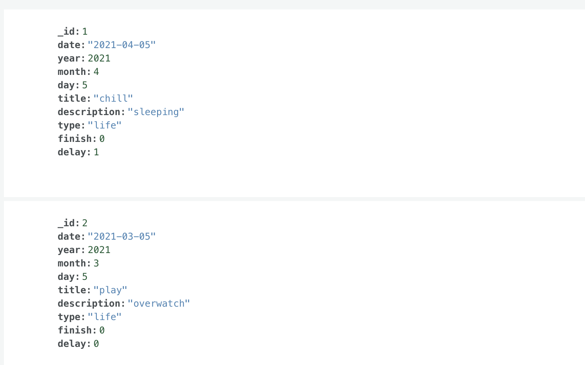
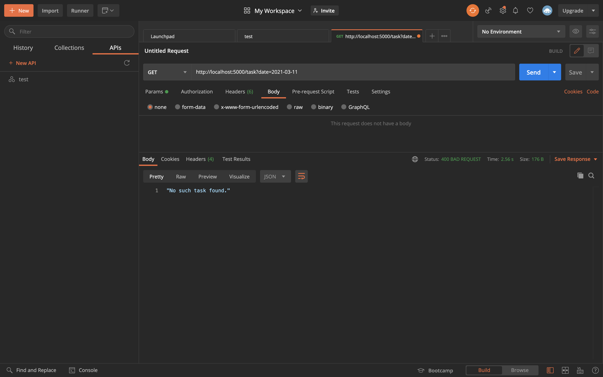
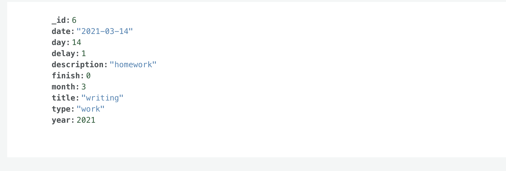
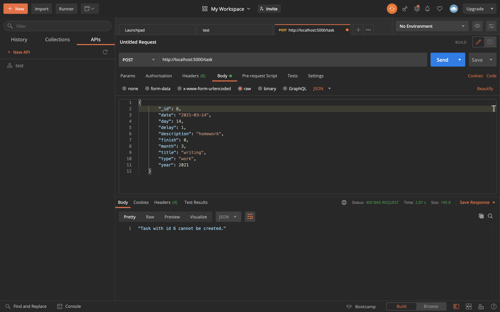
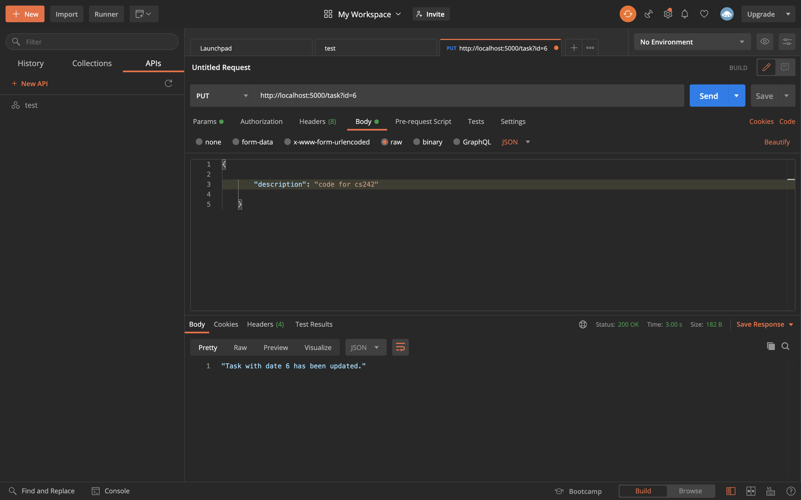
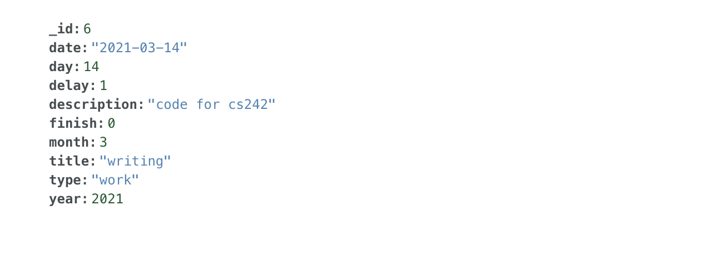
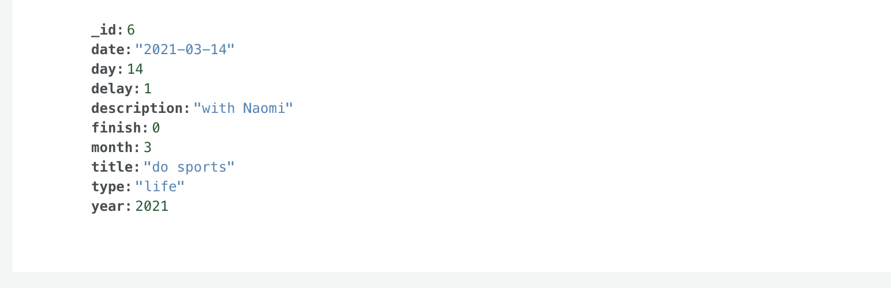
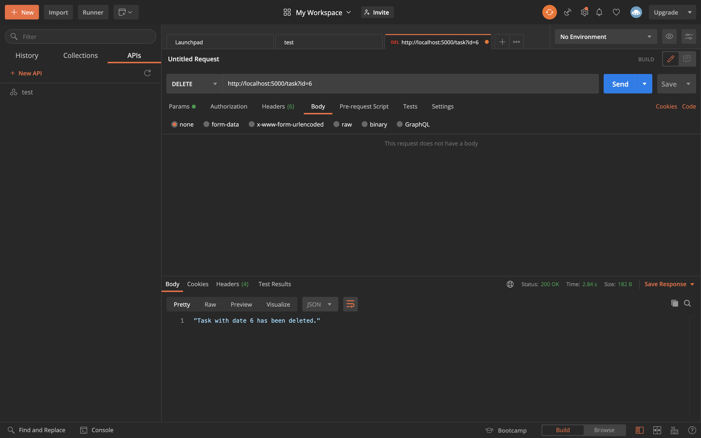
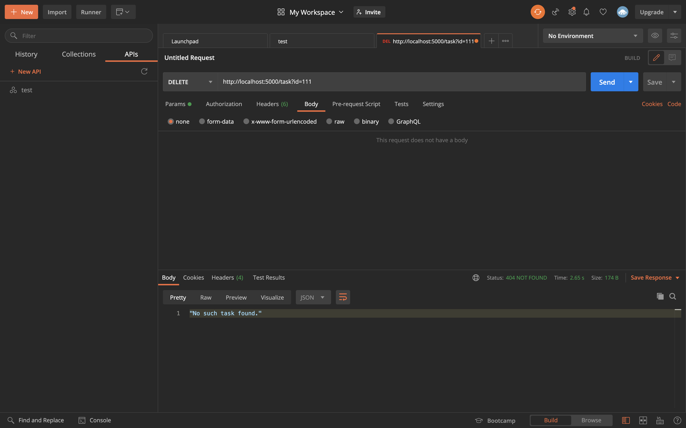

# Manual Test Plan

## Version 1.0

This manual test plan extends the web server for daily task for Qirui Lu and Xiaoying Zhu's final project, with the help of Postman to simulate user requests.

## Prerequisite

1. macOS 10.15.7 (19H2) is the recommending operating system
2. Python 3.8 with `pymongo`, `request`, `re`, `flask` should be installed for the server.
3. Postman 7.36.5 is required.

## Environment Setup and configurations

Please download the source file and run task_server.py with command `python3 task_server.py` to start the server. Then use Postman with `http://localhost:5000/` to manually test different APIs.

## Test for the task server

This is a screenshot of a glimps of the database.

We will display the moderations of our databse after calling different APIs.

For the `GET` request, The API will get all the matched data with the desired date. Moreover, if the user wants to delay the unfinished tasks and put them off to the next day, the API will only get data with delay equals to 1.

If the request in Postman is: `http://localhost:5000/task?date=2021-03-15`, then we want to get all the tasks on 2021.03.05. The Postman will return:

The database contains two tasks. We notice that the delay value for the first task is 1, and the second one is 0. Therefore, if we want to specify delay equals to 1 and make another request: `http://localhost:5000/task?date=2021-03-15&delay=1`, the Postman will return:

It will only get the tasks from the desired date which has delay value 1.

If there is no data in the databse, the Postman will return `No such task found.`, with status code 404:

If the request is invalid, say the attribute does not exist: `http://localhost:5000/task?name=2021-03-11`. The Postman will return `Please specify task.` with status code 400.

For the `POST` request, the API will add a new document into the database.

All the required information will be passed in the body, once the post request is success, the Postman will return a message with the new task id `Task with id 6 has been created`. If we look back to the database, we will find the new data:

If we want to insert the same data again, it will occur an error due to the id duplication. The Postman will return `"Task with id 6 cannot be created."`:

The message will show up if the new task has not been created.

For the `PUT` request, the API can update any valid attribute. Say we want to update the description for task id 6. We send the reuqest `http://localhost:5000/task?id=6` with the new description.

If success, it will show the message with the id `"Task with date 6 has been updated."` The database will be updated to:

The put API also support update multiple attributes at the same time.

In the database:

For the `DELETE` request, the API will delete a task according to the id. If we want to delete task 6, the reqest will be `/task?id=6`, and the Postman will show:

If success, the message will show `Task with date 6 has been deleted.`

If the id does not exist, the message will be `No such task found.` with status code 404.

