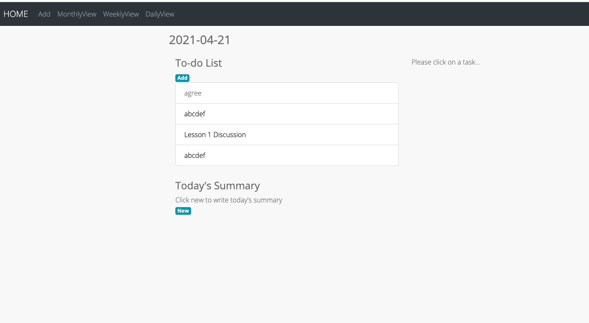
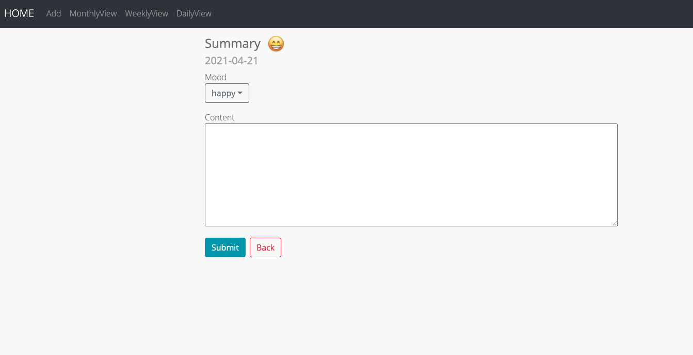
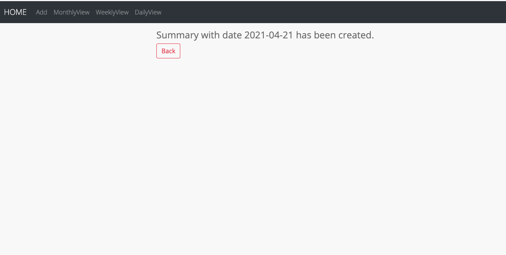
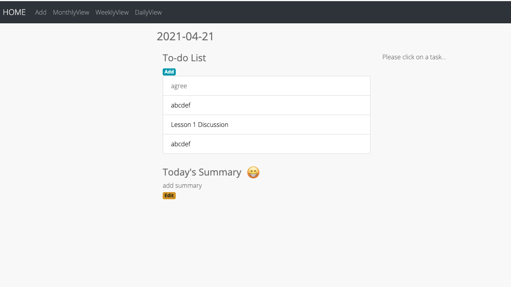
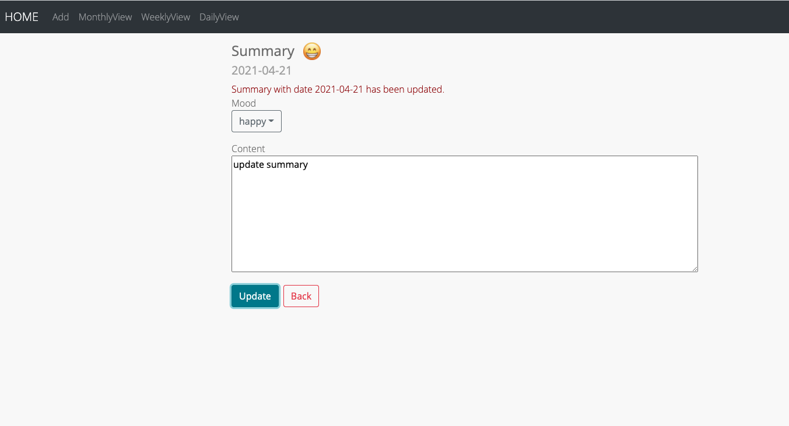
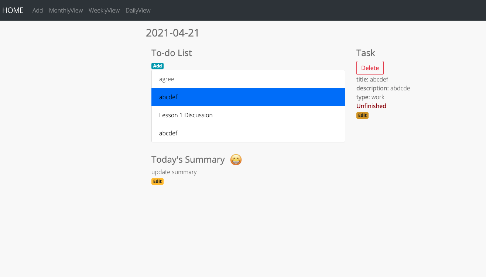
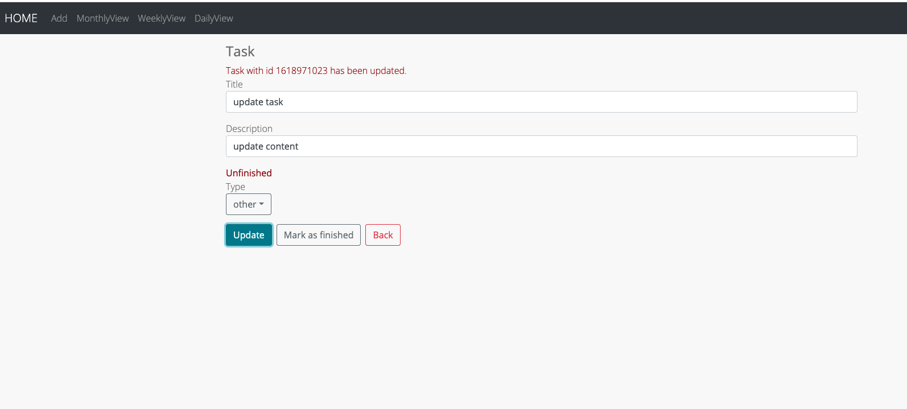
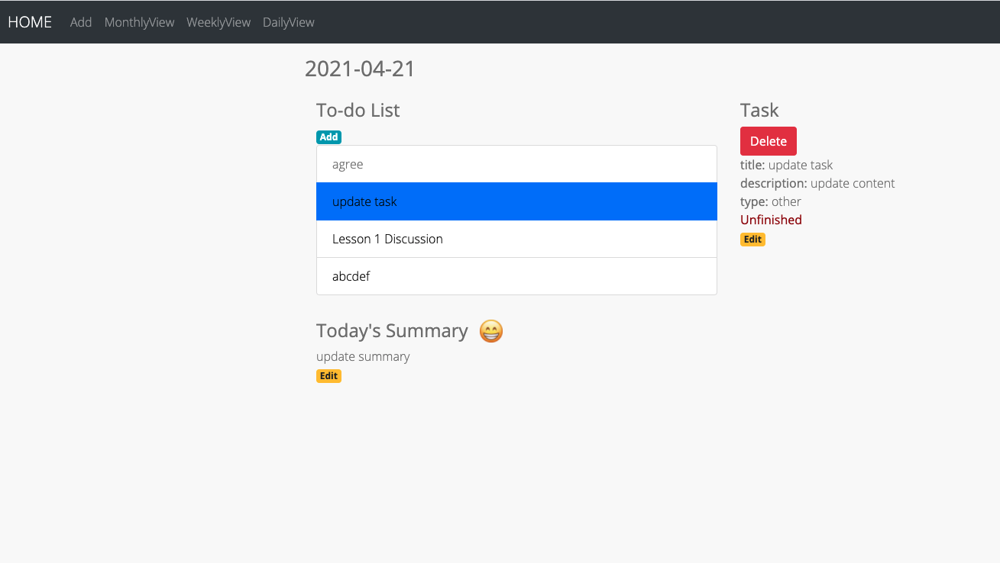
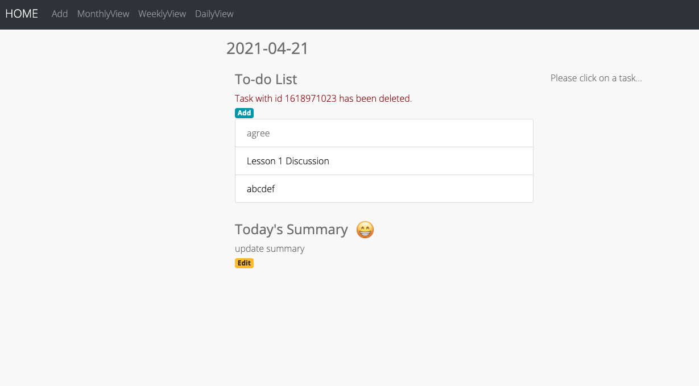

Manual Test Plan
============
Prerequisite and environment setup
---------------
Python 3.8.5\
React\
React-router-dom\
React-router

Run backend
----------
```bash
cd backend_together/
npm start
```

Run frontend
----------
```bash
cd web-calendar/
npm start
```

Test 1: HOME page
-----
Start the frontend.\
Desired output:\
Today's overview will show up



Test 2: Add summary 
----------
Find a daily view without daily summary created, click on New and add summary.\
For example:



Desired output:



Test 3: Update summary
----------
Find a daily view with daily summary created, click on edit to update summary.\
For example:



Desired output:



Test 4: Edit task
----------------
On a daily view page, select a task and click edit to update task.\
For example:



Desired output:



Test 5: Delete task
----------------
On a daily view page, select a task and click delete to delete task.\
For example:



Desired output:

